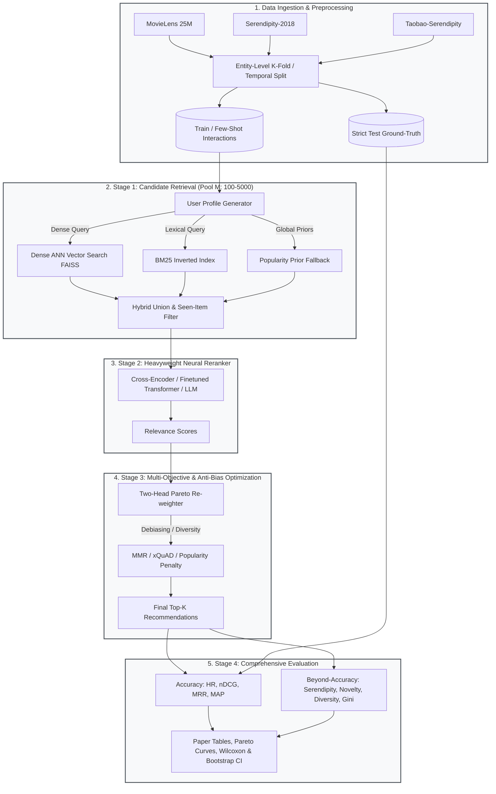

<div align="center">

# ❄️ FROST: Few-Shot & Cold-Start Recommendation Benchmark Pipeline

### *Few-shot & Cold-start Recommendation with Objective-balanced Serendipity & Trade-offs*

[](https://www.python.org/)
[](https://pytorch.org/)
[](https://huggingface.co/)
[](https://github.com/facebookresearch/faiss)
[](https://doi.org/10.5281/zenodo.18772321)
[](LICENSE.txt)
[](app.py)
[](https://github.com/psf/black)

[Live Demo](#-interactive-live-demo-recruiter-showcase) •
[Overview](#-overview) •
[Architecture](#-system-architecture) •
[Key Features](#-key-features) •
[Quickstart](#-quickstart) •
[Datasets](#-dataset-setup) •
[Running Experiments](#-running-the-pipeline) •
[Metrics](#-evaluation-metrics) •
[Citation](#-citation)

---

</div>

## 🖥️ Interactive Live Demo (Recruiter Showcase)

FROST includes an out-of-the-box **interactive Streamlit demonstration** (`app.py`) built directly on top of the production ML inference modules. Recruiters and engineers can test real recommendations in real-time across cold-start scenarios.

```bash
# Run locally with one command:
streamlit run app.py
```

### 🌟 What the Demo Showcases:
* **Cold-Start Scenarios**: Switch between **Pure Cold-Start (0 items)**, **Few-Shot (1 item)**, and **Few-Shot (5 items)** to see how sparse user signals translate into semantic profiles.
* **Retrieval Engine Switching**: Toggle between **Hybrid (Dense FAISS + BM25)**, Pure ANN Vector Search, BM25 Lexical, and Popularity baselines.
* **Neural Reranking Toggle**: Enable/disable the HuggingFace Cross-Encoder (`ms-marco-MiniLM-L-6-v2`) in Stage 2.
* **Multi-Objective Pareto Slider ($\alpha$)**: Adjust the trade-off between user relevance ($\alpha=1.0$) and serendipitous long-tail discovery ($\alpha=0.0$).
* **Real Metrics**: Live latency (ms), Intra-List Diversity (ILD), and Average Novelty calculated for every recommendation list.

### ☁️ Cloud Deployment Guide:
* **Streamlit Community Cloud**:
  1. Fork or push to your GitHub repo (`https://github.com/<your-user>/frost`).
  2. Visit [share.streamlit.io](https://share.streamlit.io) and click **New App**.
  3. Select your repository, set Main file path to `app.py`, and click **Deploy**.
  4. The lightweight demo catalog (< 3 MB) initializes automatically in ~15 seconds on free CPU instances (RAM footprint < 450 MB).
* **Hugging Face Spaces**:
  - Create a new Space with the **Streamlit SDK**, push this repository, and it boots immediately.

---

## 📖 Overview

**FROST** (**F**ew-shot & Cold-start **R**ecommendation with **O**bjective-balanced **S**erendipity & **T**rade-offs) is an academic-grade, fully reproducible research bench designed to evaluate recommendation models under strict **cold-start** (new users, new items) and **few-shot personalization** (1–20 observed interactions) constraints.

Traditional recommendation benchmarks often over-optimize for narrow accuracy metrics (e.g., Hit Rate, nDCG) on popular items, leading to severe **filter bubbles**, **popularity bias**, and poor coverage of long-tail items. FROST provides an end-to-end laboratory for evaluating:

1. **Accuracy**: HR@K, nDCG@K, MRR@K, MAP@K.
2. **Beyond-Accuracy Objectives**: Serendipity, Novelty (self-information), Intra-List Diversity (ILD), and Catalog Coverage.
3. **Systemic Fairness**: Exposure Gini coefficient, Exposure Entropy, and popularity debiasing.
4. **Pareto Multi-Objective Balancing**: Fine-grained trade-off control between user relevance and novelty.
5. **Entity-Level CV & Strict Leak-Free Splits**: Guaranteed temporal and entity-separated train/validation/test partitions with zero data contamination.

---

## 🏗️ System Architecture

FROST follows a modular two-stage retrieval and reranking topology:



---

## ✨ Key Features

| Component | Capabilities |
| :--- | :--- |
| **Stage 1: Retrieval** | Dense FAISS Vector Indexing (`all-MiniLM-L6-v2`), BM25 lexical search, Popularity fallbacks, and multi-source Hybrid union retrieval. |
| **Stage 2: Reranking** | Cross-Encoder (`ms-marco-MiniLM-L-6-v2`), task-finetuned transformers, and zero-shot LLM scoring (`Qwen2.5-3B-Instruct`). |
| **Multi-Objective Engine** | Two-head relevance vs. novelty scalarization ($\alpha \in [0, 1]$), Pareto-balanced frontiers, MMR, and xQuAD diversification. |
| **Anti-Bias & Fairness** | Popularity penalty ($\alpha \log(1+\text{pop})$), exposure penalty ($\beta \cdot \text{exposure}$), head/mid/tail slot quotas, and IPS/SNIPS counterfactual evaluation. |
| **Baselines Included** | Random, Popularity, Embedding Cosine, ItemKNN, EASE$^R$ (Embarrassingly Shallow Autoencoders), and Matrix Factorization (MF/SVD). |
| **Statistical Rigor** | Paired Wilcoxon signed-rank tests, paired t-tests, bootstrap confidence intervals, segmentation analysis, and head-collapse diagnostics. |
| **Publication Ready** | Automated generation of LaTeX tables, Markdown summary tables, Pareto trade-off curves, and resource profiling reports. |

---

## ⚡ Quickstart

### 1. Clone & Environment Setup

Ensure you have **Python 3.12+** installed:

```bash
git clone https://github.com/srinivasjangiti/frost.git
cd frost

# Create and activate virtual environment
python -m venv .venv
source .venv/bin/activate      # On Linux/macOS
# .venv\Scripts\activate       # On Windows (PowerShell)

# Upgrade pip and install dependencies
pip install --upgrade pip
pip install -r requirements.txt
```

### 2. Fast Sanity Run (30 Users, 5 Seeds)

Verify the entire pipeline end-to-end in just a few minutes using the `--fast` flag:

```bash
python -m tools.full_pipeline --clean --fast --rebuild-gt
```

### 3. Full Benchmark Run (Paper-Ready)

To run the complete benchmark suite across all seeds, datasets, and ablations:

```bash
python -m tools.full_pipeline --clean --rebuild-gt
```

---

## 📦 Dataset Setup

FROST natively supports three major benchmark datasets. Place them inside `data/`:

```
frost/
├── data/
│   ├── movieLens/
│   │   └── ml-25m/
│   │       ├── movies.csv
│   │       └── ratings.csv
│   ├── serendipity-sac2018/
│   │   ├── movies.csv
│   │   ├── tag_genome.csv
│   │   └── training.csv (or ratings.csv)
│   └── Taobao-Serendipity-Dataset-master/
│       └── (dataset files from GitHub)
```

### 1. MovieLens 25M
* **Download**: [GroupLens MovieLens 25M ZIP](https://files.grouplens.org/datasets/movielens/ml-25m.zip)
* **Target Path**: `data/movieLens/ml-25m/`
```bash
mkdir -p data/movieLens
curl -O https://files.grouplens.org/datasets/movielens/ml-25m.zip
unzip ml-25m.zip -d data/movieLens/
```

### 2. Serendipity-2018 (SAC 2018)
* **Download**: [GroupLens Serendipity-2018 Page](https://grouplens.org/datasets/serendipity-2018/)
* **Target Path**: `data/serendipity-sac2018/`
* Contains explicit user ratings along with serendipity survey questions and tag genome data.

### 3. Taobao-Serendipity Dataset
* **Source**: [Taobao Serendipity GitHub Repository](https://github.com/greenblue96/Taobao-Serendipity-Dataset)
* **Target Path**: `data/Taobao-Serendipity-Dataset-master/`
```bash
git clone https://github.com/greenblue96/Taobao-Serendipity-Dataset.git data/Taobao-Serendipity-Dataset-master
```

---

## 🚀 Running the Pipeline

### Pipeline CLI Options (`tools.full_pipeline`)

```bash
python -m tools.full_pipeline [OPTIONS]
```

| Flag | Description |
| :--- | :--- |
| `--fast` | Runs lightweight evaluation (fewer users, 1–5 seeds, Serendipity only) for fast prototyping. |
| `--clean` | Deletes prior run logs, cached splits, and master results to ensure reproducible, fresh runs. |
| `--rebuild-gt` | Re-computes leak-free ground truth splits (`src.create_splits`). Essential on first run. |
| `--skip-experiments` | Skips training/inference steps 1–5 and directly re-runs post-processing, tables, and plotting. |
| `--split-seeds` | Custom list of random seeds for K-fold data partitioning (e.g., `--split-seeds 42 123`). |
| `--init-seeds` | Custom model weight initialization seeds for variance estimation. |
| `--skip-optimizer-ablation` | Skips optimizer comparison (AdamW vs. SGD vs. Adafactor) for reranker fine-tuning. |

---

### Executing Standalone Modules

You can execute individual experiments or analysis scripts directly:

#### Single Experiment Execution
```bash
# Run hybrid retrieval with cross-encoder reranker on Serendipity
python -m src.run_all_experiments --dataset serendipity --n-users 100 --seeds 42

# Run baseline comparisons only (EASE, MF, ItemKNN, Popularity)
python -m src.run_all_experiments --dataset movielens --sanity-only
```

#### Ablation Studies
```bash
# Candidate retrieval ablation (ANN vs. BM25 vs. Hybrid across pool sizes)
python -m src.run_retrieval_ablation --n-users 100 --pool-sizes 100 300 500 1000 --seeds 42

# Relevance vs. Novelty Pareto sweep (alpha in [0, 0.25, 0.5, 0.75, 1.0])
python -m tools.run_pareto_sweep --run --n-users 100 --seeds 42 --dataset serendipity

# Debiasing coefficient sweep (popularity penalty vs. exposure penalty)
python -m src.run_debias_sweep --n-users 100 --seeds 42 --dataset serendipity
```

#### Post-Processing & Visualizations
```bash
# Aggregate all runs into unified master results table
python -m tools.build_master_results
python -m tools.aggregate_runs

# Generate publication-ready LaTeX & Markdown tables
python -m tools.generate_paper_tables

# Generate Pareto front & serendipity trade-off figures
python -m tools.plot_serendipity_tradeoff
python -m tools.plot_multiobjective_policy

# Counterfactual evaluation (IPS & SNIPS)
python -m tools.ips_counterfactual_eval

# Statistical significance tests (p-values & effect sizes)
python -m tools.stat_tests
```

---

## 📊 Evaluation Metrics

FROST calculates a comprehensive suite of metrics for every user and model:

```
┌────────────────────────┬────────────────────────────────────────────────────────┐
│ Metric Category        │ Metric Name & Formulation                              │
├────────────────────────┼────────────────────────────────────────────────────────┤
│ Accuracy               │ HR@K (Hit Rate)                                        │
│                        │ nDCG@K (Normalized Discounted Cumulative Gain)         │
│                        │ MRR@K (Mean Reciprocal Rank)                           │
│                        │ MAP@K (Mean Average Precision)                         │
├────────────────────────┼────────────────────────────────────────────────────────┤
│ Beyond-Accuracy        │ Catalog Coverage @ K                                   │
│                        │ User Coverage (fraction of users with valid recs)      │
│                        │ Mean Self-Information Novelty (-log2 P(item))          │
│                        │ Intra-List Diversity (ILD via pairwise cosine dist)   │
│                        │ Serendipity Score (Unexpectedness * Relevance)         │
├────────────────────────┼────────────────────────────────────────────────────────┤
│ Bias & Fairness        │ Exposure Gini Coefficient (0 = uniform, 1 = monopoly)  │
│                        │ Exposure Entropy (distribution spread)                 │
│                        │ IPS / SNIPS (Inverse Propensity Scoring)               │
│                        │ Head / Mid / Tail Ratio in Top-K                       │
└────────────────────────┴────────────────────────────────────────────────────────┘
```

---

## 📁 Repository Structure

```text
frost/
├── src/                               # Core algorithm & pipeline source code
│   ├── baselines.py                   # Classical baselines (Random, Popularity, Cosine)
│   ├── baselines_strong.py            # Advanced collaborative baselines (EASE^R, MF, ItemKNN)
│   ├── bm25.py                        # BM25 lexical retriever implementation
│   ├── candidate_retrieval.py         # Multi-modal retrieval (FAISS dense + BM25 + Popularity)
│   ├── config.py                      # Global configuration & model hyperparameters
│   ├── create_splits.py               # Leak-free entity-level and temporal split engine
│   ├── embeddings.py                  # Text embedding generation (SentenceTransformers)
│   ├── metrics.py                     # Evaluation metrics (Accuracy, Diversity, Novelty, Gini)
│   ├── rerank_crossencoder.py         # Cross-Encoder neural reranking
│   ├── rerank_diversify.py            # MMR, xQuAD, and anti-bias diversification
│   ├── rerank_two_head.py             # Multi-objective Pareto relevance + novelty weighting
│   ├── run_all_experiments.py         # Batch experiment executor
│   ├── run_experiment.py              # Main single-run orchestration engine
│   └── vector_index.py                # FAISS index construction & persistence
├── tools/                             # Research tooling, post-processing & analysis
│   ├── aggregate_runs.py              # Aggregates runs across seeds and splits
│   ├── build_master_results.py        # Compiles per-user granular metrics
│   ├── full_pipeline.py               # Master orchestration script (Steps 0–17)
│   ├── generate_paper_tables.py       # Exports LaTeX and Markdown tables
│   ├── ips_counterfactual_eval.py     # Counterfactual IPS / SNIPS estimation
│   ├── plot_serendipity_tradeoff.py   # Pareto curves for Accuracy vs. Serendipity
│   ├── plot_multiobjective_policy.py  # Policy selection trajectories
│   └── stat_tests.py                  # Hypothesis testing (Wilcoxon, t-test)
├── data/                              # Dataset storage (MovieLens, Serendipity, Taobao)
├── experiments/                       # Output artifacts, tables, and generated figures
├── CITATION.cff                       # Citation metadata
├── requirements.txt                   # Python package dependencies
└── LICENSE.txt                        # MIT License
```

---

## 🔬 Generated Artifacts & Reports

After running the pipeline, generated artifacts are deposited in `experiments/`:

* **Tables**: `experiments/tables/` (`summary_table.tex`, `ablation_table.md`, `cv_results.csv`)
* **Plots**: `experiments/plots/` (High-resolution PDF, SVG, and PNG figures for Pareto frontiers, coverage, and calibration)
* **Granular Logs**: `experiments/runs.jsonl` and `experiments/master_results.json`
* **Reports**:
  * `experiments/resources/resource_report.md` (Latency, memory footprint, and compute scaling)
  * `experiments/counterfactual_evaluation/` (Debiased performance under selection bias)
  * `experiments/stat_tests/` (Hypothesis validation and statistical significance reports)

---

## 📜 Citation

If you use this benchmark codebase or methodology in your research, please cite our work:

```bibtex
@article{lemdiasova2026frost,
  title   = {FROST: Few-shot & Cold-start Recommendation with Objective-balanced Serendipity & Trade-offs},
  author  = {Lemdiasova, Ekaterina and Zmanovskii, Nikita},
  year    = {2026},
  month   = {February},
  publisher = {Zenodo},
  doi     = {10.5281/zenodo.18772321},
  url     = {https://doi.org/10.5281/zenodo.18772321}
}
```

---

## 📄 License

This project is licensed under the MIT License — see the [LICENSE.txt](LICENSE.txt) file for details.
