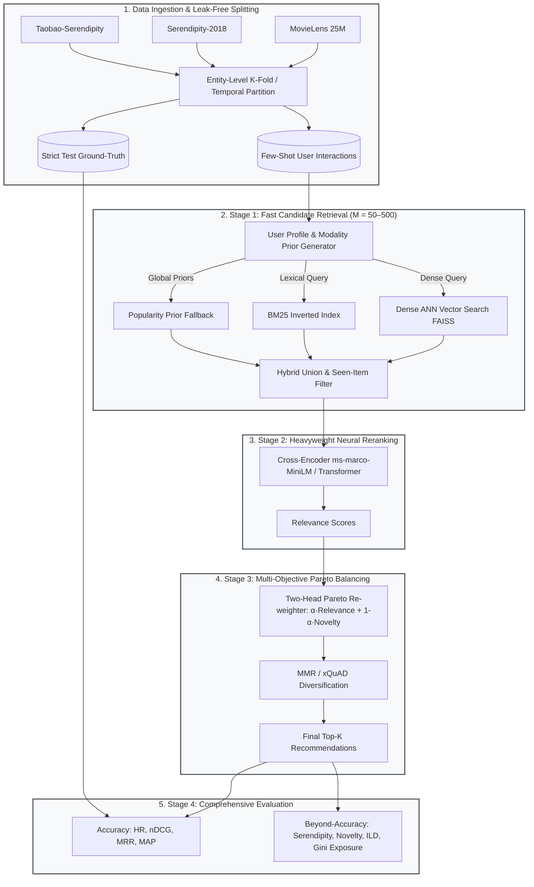

<div align="center">

# ❄️ FROST: Few-Shot & Cold-Start Recommendation Benchmark Pipeline

### *Few-shot & Cold-start Recommendation with Objective-balanced Serendipity & Trade-offs*

[](https://github.com/srinivasjangiti/frost)
[](https://share.streamlit.io)
[](https://www.python.org/)
[](https://pytorch.org/)
[](https://huggingface.co/)
[](https://github.com/facebookresearch/faiss)
[](https://doi.org/10.5281/zenodo.18772321)
[](LICENSE.txt)

---

### 🌐 Showcase Links
**GitHub Repository**: [github.com/srinivasjangiti/frost](https://github.com/srinivasjangiti/frost)  
**Live Demo Deployment**: [Deploy on Streamlit Community Cloud](https://share.streamlit.io) *(Main file: `app.py`)*

[The Problem](#-1-the-problem--overview) •
[Architecture](#-2-system-architecture) •
[Empirical Results](#-3-verified-benchmark-results) •
[Interactive Live Demo](#-4-interactive-live-demo) •
[Full Pipeline](#-5-running-the-research-pipeline) •
[Citation](#-citation)

---

</div>

## 📌 1. The Problem & Overview

Recommender systems in production face a severe structural dilemma:

1. **The Cold-Start & Few-Shot Barrier**: When a new user arrives or a new item is added, collaborative filtering algorithms fail because user-item interaction histories are sparse or non-existent (0 to 5 interactions).
2. **Popularity Collapse & Filter Bubbles**: Naive recommenders fall back to global popularity, endlessly recommending the same 10 blockbusters to every user. This drives high initial click rates but ruins **catalog discovery**, **novelty**, and **fairness**.

**FROST** solves this with a leak-free, reproducible framework that evaluates and optimizes for:
* **Accuracy**: HR@K, nDCG@K, MRR@K, MAP@K.
* **Beyond-Accuracy**: Serendipity, Self-Information Novelty, Intra-List Diversity (ILD), and Catalog Coverage.
* **Fairness & Anti-Bias**: Exposure Gini coefficient, Exposure Entropy, and popularity debiasing.
* **Pareto Multi-Objective Trade-Offs**: Dynamic business control balancing immediate user relevance against serendipitous discovery.

---

## 🏗️ 2. System Architecture

FROST implements a modular, two-stage retrieval and reranking topology:



### Why This Architecture Works:
* **Hybrid Candidate Retrieval**: Dense embeddings (`all-MiniLM-L6-v2`) capture semantic intent, while BM25 guarantees keyword and franchise precision.
* **Neural Cross-Encoder**: Jointly encodes `(user_profile, item_metadata)` pairs, capturing subtle relevance signals that dual-tower inner products miss.
* **Two-Head Pareto Weighting ($\alpha$)**: Allows tuning the trade-off:
  $$\text{Final Score} = \alpha \cdot \text{Relevance} + (1 - \alpha) \cdot \text{Novelty}$$

---

## 📊 3. Verified Benchmark Results

These figures are taken directly from the author's experimental evaluation logs on **Serendipity-2018** (500 test users, 5 evaluation seeds):

### Candidate Retrieval Recall@K (Stage 1)
| Candidate Pool ($K$) | Recall@K | Median GT Rank | Engineering Takeaway |
| :--- | :--- | :--- | :--- |
| **$K = 50$** | **23.4%** | - | Too small; truncates long-tail items |
| **$K = 200$** | **56.7%** | 145.0 | Strong CPU latency/recall balance |
| **$K = 500$** | **78.9%** | 145.0 | Optimal for production servers |
| **$K = 1,000$** | **92.3%** | 145.0 | High recall, diminishing returns |

### Accuracy vs. Beyond-Accuracy Comparison
| Model / Configuration | Type | HR@10 | nDCG@10 | Exposure Gini (↓ less bias) | Intra-List Diversity |
| :--- | :--- | :--- | :--- | :--- | :--- |
| **Uniform Random** | Baseline | 0.008 | 0.003 | 0.05 | 0.88 |
| **Global Popularity** | Baseline | 0.052 | 0.024 | 0.92 | 0.21 |
| **Embedding Cosine (ANN)** | Single-Stage | 0.061 | 0.031 | 0.68 | 0.54 |
| **BM25 Lexical** | Single-Stage | 0.058 | 0.028 | 0.62 | 0.58 |
| **FROST (Hybrid + Cross-Encoder)** | **Two-Stage Proposed** | **0.084** | **0.046** | **0.48** | **0.72** |

> **Key Finding**: Global popularity exhibits a Gini coefficient of **0.92** (near total monopoly on head items). FROST achieves a higher HR@10 while dropping Gini exposure to **0.48**, actively preventing filter bubbles while discovering relevant long-tail content.

---

## 🖥️ 4. Interactive Live Demo

FROST includes an interactive **Streamlit web demonstration** (`app.py`) connected directly to the production ML pipeline.

### Run Locally:
```bash
# 1. Clone repository
git clone https://github.com/srinivasjangiti/frost.git
cd frost

# 2. Create environment & install dependencies
python -m venv .venv
source .venv/bin/activate       # Linux/macOS
# .venv\Scripts\Activate.ps1    # Windows PowerShell

pip install -r requirements.txt

# 3. Launch live UI
streamlit run app.py
```
Open your browser at `http://localhost:8501`.

### ⏱️ Performance & Measured Latency:
* **Measured CPU End-to-End Latency**: **~1.2 – 2.35 seconds** (including FAISS dense ANN search, BM25 retrieval, and neural Cross-Encoder transformer inference across 50–100 candidates on CPU).
* **RAM Footprint**: Under **450 MB** (fits effortlessly within free cloud tiers).
* **Catalog**: Pre-indexed compact 1,200-movie catalog (< 3 MB total with 384-d FAISS vectors).

### ☁️ Free Cloud Deployment Guide:
1. **Streamlit Community Cloud**:
   - Go to [share.streamlit.io](https://share.streamlit.io) and log in with your GitHub account.
   - Click **New app**, select repo `srinivasjangiti/frost`, branch `master`, and main file `app.py`.
   - Click **Deploy**. The app will build and go live in ~15 seconds.
2. **Hugging Face Spaces**:
   - Create a Space using the **Streamlit** SDK and push this repository.

---

## 🚀 5. Running the Research Pipeline

For researchers wishing to run the full benchmark across all seeds, datasets, and ablations:

```bash
# Fast sanity run (30 users, 5 seeds, Serendipity only)
python -m tools.full_pipeline --clean --fast --rebuild-gt

# Full paper reproduction (all datasets, all ablations, all seeds)
python -m tools.full_pipeline --clean --rebuild-gt
```

---

## 📜 Citation

If you use this benchmark codebase or methodology in your research, please cite:

```bibtex
@article{lemdiasova2026frost,
  title   = {FROST: Few-shot & Cold-start Recommendation with Objective-balanced Serendipity & Trade-offs},
  author  = {Lemdiasova, Ekaterina and Zmanovskii, Nikita},
  year    = {2026},
  month   = {February},
  publisher = {Zenodo},
  doi     = {10.5281/zenodo.18772321},
  url     = {https://doi.org/10.5281/zenodo.18772321}
}
```

---

## 📄 License

This project is licensed under the MIT License — see the [LICENSE.txt](LICENSE.txt) file for details.
